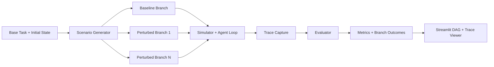

# Time-Travel Evals (TTE)

Time-Travel Evals (TTE) is an evaluation framework for autonomous agents that measures resilience across alternate realities, not just success on a single happy path.

Instead of asking "Did the agent pass one run?", TTE asks:

- How does the same agent perform when conditions diverge?
- How quickly does it recover after failures?
- Does it spiral under pressure?

TTE runs one task over a baseline timeline and multiple perturbed branches (for example, dependency crash, CPU spike, latency anomaly), then computes robustness-oriented metrics and visualizes the full trace in Streamlit.

## Demo Video

- [Time Travel Evals Demo (MP4)](media/time-travel-evals-demo.mp4)

## Table of Contents

- [Problem](#problem)
- [Solution](#solution)
- [Core Capabilities](#core-capabilities)
- [Demo Video](#demo-video)
- [Architecture](#architecture)
- [Repository Layout](#repository-layout)
- [Prerequisites](#prerequisites)
- [Quick Start (5 Minutes)](#quick-start-5-minutes)
- [Environment Variables](#environment-variables)
- [Run the Project](#run-the-project)
- [How Evaluation Works](#how-evaluation-works)
- [Metrics Explained](#metrics-explained)
- [Execution Modes and Runtime Planning](#execution-modes-and-runtime-planning)
- [Logs and Cache](#logs-and-cache)
- [Testing](#testing)
- [Troubleshooting](#troubleshooting)
- [End-to-End Runbook](#end-to-end-runbook)
- [Development Notes](#development-notes)

## Problem

Conventional agent benchmarks usually evaluate a single trajectory. In real systems, that is insufficient because failures compound:

- A deployment can be marked successful while a dependency silently fails.
- The agent may repeat low-value actions instead of recovering.
- Under stress, decision quality often drops before obvious failure appears.

This gap makes single-run pass rates misleading for production readiness.

## Solution

TTE evaluates an agent over a multiverse of branch timelines:

1. Generate one baseline branch plus perturbation branches.
2. Replay the same task in each branch with a simulator and agent loop.
3. Capture step-level traces and final states.
4. Score robustness, success rate, stability, panic behavior, and recovery.
5. Visualize everything in an interactive DAG and detailed trace view.

## Core Capabilities

- Rule-based and LLM-generated scenario branches.
- LLM or rules-only execution modes.
- Provider support for NVIDIA and OpenAI compatible endpoints.
- Rate-limit-aware scheduling with retry and backoff.
- Persistent semantic cache (SQLite) for repeatable runs.
- Streamlit UI with interactive branch DAG and step-by-step trace inspection.
- CLI pipeline for automation and CI-style runs.

## Architecture



## Repository Layout

```text
.
├── core/
│   ├── agent_runner.py
│   ├── config.py
│   ├── evaluator.py
│   ├── execution.py
│   ├── llm_cache.py
│   ├── llm_judge.py
│   ├── llm_utils.py
│   ├── logger.py
│   ├── models.py
│   ├── provider_capabilities.py
│   ├── runtime_budget.py
│   ├── scenario_generator.py
│   └── simulator.py
├── data/
├── tests/
├── ui/
│   ├── app.py
│   ├── assets/
│   └── components/
├── main.py
├── requirements.txt
└── .env.example
```

## Prerequisites

- Python 3.10+ (3.12 recommended)
- pip
- One provider API key:
  - `OPENAI_API_KEY` for OpenAI
  - `NVIDIA_API_KEY` for NVIDIA-hosted models

Optional but recommended:

- A virtual environment (`venv`)
- 4 GB+ RAM for smoother Streamlit + test workflows

## Quick Start (5 Minutes)

### 1) Clone and enter project

```bash
git clone <your-repo-url>
cd TTE
```

### 2) Create and activate virtual environment

PowerShell (Windows):

```powershell
python -m venv .venv
.\.venv\Scripts\Activate.ps1
```

Bash (macOS/Linux):

```bash
python -m venv .venv
source .venv/bin/activate
```

### 3) Install dependencies

```bash
pip install -r requirements.txt
```

### 4) Configure environment

PowerShell:

```powershell
Copy-Item .env.example .env
```

Bash:

```bash
cp .env.example .env
```

Edit `.env` and set at least one real API key.

### 5) Start Streamlit UI

```bash
python -m streamlit run ui/app.py --server.headless true --server.port 8501
```

Open `http://localhost:8501`.

## Environment Variables

The app loads `.env` automatically from `core/config.py`.

### Provider selection and credentials

| Variable         | Required        | Default                    | Description                              |
| ---------------- | --------------- | -------------------------- | ---------------------------------------- |
| `TTE_PROVIDER`   | No              | `openai` in `.env.example` | Default provider (`openai` or `nvidia`). |
| `OPENAI_API_KEY` | If using OpenAI | empty                      | OpenAI API key.                          |
| `NVIDIA_API_KEY` | If using NVIDIA | empty                      | NVIDIA API key.                          |

### Provider endpoints and models

| Variable                     | Required | Default                               | Description                                                  |
| ---------------------------- | -------- | ------------------------------------- | ------------------------------------------------------------ |
| `TTE_OPENAI_API_BASE_URL`    | No       | `https://api.openai.com/v1`           | OpenAI-compatible base URL for OpenAI provider.              |
| `TTE_NVIDIA_API_BASE_URL`    | No       | `https://integrate.api.nvidia.com/v1` | Base URL for NVIDIA provider.                                |
| `TTE_OPENAI_MODEL_GENERATOR` | No       | `gpt-5.4-nano`                        | Model used for scenario generation and judge in OpenAI mode. |
| `TTE_OPENAI_MODEL_AGENT`     | No       | `gpt-5.4-nano`                        | Model used for agent steps in OpenAI mode.                   |
| `TTE_NVIDIA_MODEL_GENERATOR` | No       | `moonshotai/kimi-k2.5`                | Generator model in NVIDIA mode.                              |
| `TTE_NVIDIA_MODEL_AGENT`     | No       | `moonshotai/kimi-k2.5`                | Agent model in NVIDIA mode.                                  |

### Runtime and execution planning

| Variable                   | Required | Default | Description                                                            |
| -------------------------- | -------- | ------- | ---------------------------------------------------------------------- |
| `TTE_EXECUTION_MODE`       | No       | `auto`  | `auto`, `standard`, or `turbo`.                                        |
| `TTE_PROVIDER_PROFILE`     | No       | `auto`  | Capability profile (`auto`, `batched_json`, `strict_json`, `generic`). |
| `TTE_MAX_BRANCHES`         | No       | `4`     | Max branches (capped in code).                                         |
| `TTE_MAX_STEPS_PER_BRANCH` | No       | `8`     | Max steps per branch (capped in code).                                 |
| `TTE_ENABLE_LLM_JUDGE`     | No       | `true`  | Enables LLM panic/judge scoring.                                       |
| `TTE_AGENT_BATCH_HISTORY`  | No       | `2`     | Number of recent turns per branch for batched prompts.                 |

### Rate limits and retries

| Variable                          | Required | Default | Description                                  |
| --------------------------------- | -------- | ------- | -------------------------------------------- |
| `TTE_MAX_REQUESTS_PER_MINUTE`     | No       | `40`    | Configured RPM budget.                       |
| `TTE_RATE_LIMIT_SAFETY_FACTOR`    | No       | `0.8`   | Conservative multiplier on RPM.              |
| `TTE_LLM_MAX_RETRIES`             | No       | `2`     | Retries on quota/rate-limit errors.          |
| `TTE_LLM_BACKOFF_BASE_SECONDS`    | No       | `1.5`   | Exponential backoff base.                    |
| `TTE_LLM_BACKOFF_MAX_SECONDS`     | No       | `20.0`  | Max backoff cap.                             |
| `TTE_LLM_REQUEST_TIMEOUT_SECONDS` | No       | `20.0`  | Request timeout floor is enforced by config. |

### Logs and cache

| Variable         | Required | Default                    | Description                              |
| ---------------- | -------- | -------------------------- | ---------------------------------------- |
| `TTE_LOG_DIR`    | No       | `./logs`                   | JSONL run logs path.                     |
| `TTE_CACHE_PATH` | No       | `./logs/llm_cache.sqlite3` | Persistent semantic cache database path. |

## Run the Project

### Streamlit server

```bash
python -m streamlit run ui/app.py --server.headless true --server.port 8501
```

Then visit `http://localhost:8501`.

### CLI orchestrator

Run with defaults:

```bash
python main.py
```

Custom task, branches, and steps:

```bash
python main.py --task "Deploy version 2 of the frontend application to production" --branches 4 --steps 8
```

Select provider explicitly:

```bash
python main.py --provider openai --task "Investigate and resolve a production outage"
python main.py --provider nvidia --task "Investigate and resolve a production outage"
```

Modes:

```bash
# Rule-based scenario generation + live LLM agent
python main.py --demo

# Fully offline (no provider calls)
python main.py --rules-only
```

Export results JSON:

```bash
python main.py --output data/cached_demo.json
```

### Optional: API connectivity check

```bash
python verify_openai.py
```

Note: this script checks `config.API_KEY` and `config.API_BASE_URL` from the active provider config.

## How Evaluation Works

TTE executes three major phases in `main.py`:

1. Scenario generation
   - LLM or rules-based branch generation
   - One baseline branch plus perturbation branches

2. Branch execution
   - Simulator advances state each step
   - Agent chooses one action per step
   - Trace is captured with observations, actions, events, state transitions

3. Metric computation
   - Computes robustness, success, stability
   - Optional LLM judge computes panic and explanation

## Metrics Explained

- Robustness Score: how well behavior holds across branch perturbations.
- Success Rate: fraction of branches reaching successful final state.
- Stability Score: consistency of branch outcomes.
- Panic Score: higher means more spiraling behavior under stress.
- Recovery Time: mean steps to recover when a branch degrades then recovers.

## Execution Modes and Runtime Planning

`core/execution.py` and `core/runtime_budget.py` coordinate runtime behavior.

- `standard`: per-step calls per branch.
- `turbo`: batched branch prompts (when capability profile supports it).
- `auto`: chooses `turbo` when call budget exceeds effective RPM and provider supports batching.

Effective RPM is computed from configured RPM and conservative safety factors.

## Logs and Cache

- Structured run logs are written as JSONL under `logs/`.
- Semantic cache is SQLite (`logs/llm_cache.sqlite3` by default).
- Cache hits reduce repeated provider calls on deterministic prompts.

Useful cleanup commands:

```powershell
# Remove cached provider responses
Remove-Item .\logs\llm_cache.sqlite3 -ErrorAction SilentlyContinue

# Remove old run logs
Remove-Item .\logs\*.jsonl -ErrorAction SilentlyContinue
```

## Testing

Run all tests:

```bash
pytest tests/
```

Run focused regression tests:

```bash
pytest tests/test_llm_rate_limit.py -q
pytest tests/test_execution_modes.py -q
```

## Troubleshooting

### 1) "API key missing" or provider validation fails

Symptoms:

- CLI exits with missing key message.
- UI shows provider key not set.

Fix:

- Ensure `.env` has the correct key for selected provider.
- Confirm `TTE_PROVIDER` and runtime provider selection match your key.

### 2) Fallback errors mentioning unsupported `max_tokens`

Symptoms:

- Branch trace shows repeated "API error fallback" with unsupported parameter.

Status:

- The code now maps token limit parameters by provider/model in `core/llm_utils.py`.

If you still see this:

- Pull latest code.
- Restart Streamlit/CLI process.
- Clear cache file (`logs/llm_cache.sqlite3`) and rerun.

### 3) Rate limit errors (429 or too many requests)

Fixes:

- Lower `TTE_MAX_BRANCHES` and `TTE_MAX_STEPS_PER_BRANCH`.
- Lower `TTE_MAX_REQUESTS_PER_MINUTE` to your real provider quota.
- Keep `TTE_RATE_LIMIT_SAFETY_FACTOR` at `0.8` or lower.
- Use `TTE_EXECUTION_MODE=auto` with batched-capable profiles.

### 4) Streamlit port already in use

Start on a different port:

```bash
python -m streamlit run ui/app.py --server.port 8511
```

### 5) Streamlit crashes with OpenBLAS allocation/thread errors

Symptoms:

- Startup fails with OpenBLAS memory/thread messages.

Fix (PowerShell session):

```powershell
$env:OPENBLAS_NUM_THREADS = "1"
$env:OMP_NUM_THREADS = "1"
python -m streamlit run ui/app.py --server.headless true --server.port 8501
```

### 6) Test collection MemoryError around Streamlit imports

Fixes:

- Run focused test modules first (`test_llm_rate_limit.py`, `test_execution_modes.py`).
- Close heavy processes and retry full suite.
- Use lower-memory environment or rerun after fresh shell.

### 7) UI run is too slow

Use one of these:

- Demo mode in sidebar (zero provider calls).
- Smaller run profile (for example, 2 branches x 4 steps).
- Disable judge (`TTE_ENABLE_LLM_JUDGE=false`).

### 8) Empty or stale looking results

Try:

- Hard refresh browser page.
- Remove cache DB and rerun.
- Confirm model and provider base URL are valid in `.env`.

### 9) Streamlit warns about `use_container_width`

This is a deprecation warning from Streamlit and does not block execution.

## End-to-End Runbook

Use this runbook when setting up from scratch:

1. Create virtual environment and install requirements.
2. Copy `.env.example` to `.env` and set one provider key.
3. Start Streamlit server.
4. Open UI and choose provider in sidebar.
5. Start with demo mode to confirm pipeline and visuals.
6. Disable demo mode and run a small live profile (2x4).
7. Inspect DAG and branch trace details.
8. Export JSON for sharing/audit.
9. Tune RPM/branches/steps for your quota and latency budget.

## Development Notes

- Main orchestrator: `main.py`
- Config singleton and env parsing: `core/config.py`
- Execution mode and cache scheduling: `core/execution.py`
- Rate limiting and retry helpers: `core/llm_utils.py`
- Scenario generation: `core/scenario_generator.py`
- Simulator: `core/simulator.py`
- Agent loop: `core/agent_runner.py`
- Judge scoring: `core/llm_judge.py`
- UI entrypoint: `ui/app.py`

For local development, keep `.env` out of version control and avoid committing provider keys.

## Project Status

This repository is an actively evolving prototype with production-minded controls (rate limiting, cache, telemetry), intended for robust agent evaluation experiments and demos.
